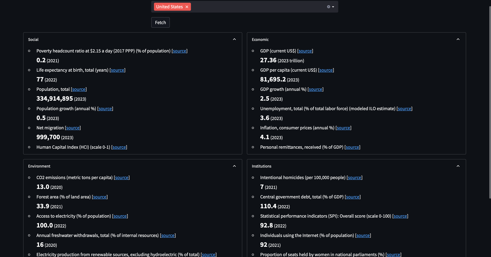

I have developed this app using R-shiny for learning purposes only.

It takes a country name (or two countries for comparison purposes) as input and returns the most recent values of social, economic, environmental, and institutional indicators indicators from the World Bank (https://data.worldbank.org/country).

Please use this [link](https://connect.posit.cloud/Fahim-Ahmad/content/0191367c-1fb8-721f-69ce-ebf845609b44) or click on below image to open the app.

