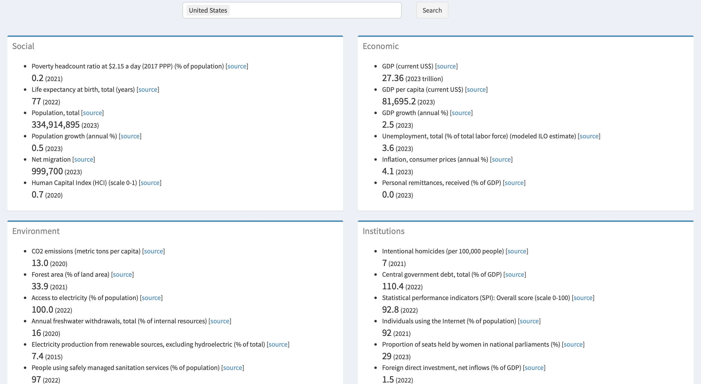

I developed this app using streamlit in python for learning purposes only.

It takes a country name (or two countries for comparison purposes) as input and returns the most recent values of social economic, and environmental indicators from the World Bank (https://data.worldbank.org/country).

Please use this [link](https://wb-indicators.streamlit.app) or click on below image to open the app.

<!-- 

-->
